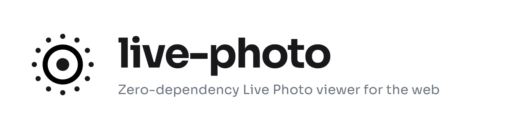

<div align="center">

<picture>
  <source media="(prefers-color-scheme: dark)" srcset="./assets/banner-dark.png" />
  
</picture>

<p></p>

零依赖的网页 <strong>实况照片（Live Photo）</strong> 播放器，兼容所有主流框架和原生 JavaScript。

[](https://www.npmjs.com/package/live-photo) [](https://www.npmjs.com/package/live-photo) [](https://bundlephobia.com/package/live-photo) [](https://www.npmjs.com/package/live-photo) [](./LICENSE)

**[English](./README.md)** · **[中文文档](./README.zh-CN.md)** · **[在线示例](https://live-photo.netlify.app)**

</div>

---

## ✨ 特性

- 🪶 **零依赖** —— 体积极小，可嵌入任意技术栈
- 🧩 **框架无关** —— 原生 JS、Vue 3、React 或 CDN script 标签
- 📱 **桌面与移动端** —— 桌面悬停播放，触屏设备长按播放
- 🌗 **主题与国际化** —— 浅色 / 深色 / 自动主题，内置多语言
- ⚡ **懒加载** —— 视频进入视口后再加载
- 🎛️ **完整类型** —— 一流的 TypeScript 支持

## 📦 安装

```bash
npm install live-photo
# pnpm add live-photo
# yarn add live-photo
```

## 🚀 快速开始

**CDN**
```html
<script src="https://fastly.jsdelivr.net/npm/live-photo@latest"></script>
<div id="container"></div>
<script>
  new LivePhotoViewer({
    photoSrc: 'photo.jpg',
    videoSrc: 'video.mp4',
    container: document.getElementById('container'),
  });
</script>
```

**ES Module**
```js
import { LivePhotoViewer } from 'live-photo';

const viewer = new LivePhotoViewer({
  photoSrc: 'photo.jpg',
  videoSrc: 'video.mp4',
  container: document.getElementById('container'),
});
```

→ 更多示例：[原生 JS](./docs/vanilla.md) · [Vue 3](./docs/vue.md) · [React](./docs/react.md)

## ⚙️ 配置项

| 参数 | 类型 | 默认值 | 说明 |
|------|------|--------|------|
| `photoSrc` | `string` | **必填** | 图片 URL |
| `videoSrc` | `string` | **必填** | 视频 URL |
| `container` | `HTMLElement` | **必填** | 挂载容器 |
| `width` | `number \| string` | `300px` | 宽度 |
| `height` | `number \| string` | `300px` | 高度 |
| `autoplay` | `boolean` | `true` | 桌面端悬停 / 移动端长按自动播放 |
| `lazyLoadVideo` | `boolean` | `false` | 进入视口后再加载视频 |
| `longPressDelay` | `number` | `300` | 移动端长按阈值（毫秒） |
| `muted` | `boolean` | `true` | 初始静音 |
| `showMuteButton` | `boolean` | `true` | 显示静音切换按钮 |
| `borderRadius` | `number \| string` | — | 容器圆角 |
| `theme` | `'light' \| 'dark' \| 'auto'` | — | UI 颜色主题 |
| `preload` | `'auto' \| 'metadata' \| 'none'` | `'metadata'` | 视频预加载策略 |
| `retryAttempts` | `number` | `3` | 加载失败重试次数 |
| `enableVibration` | `boolean` | `true` | 播放时触发震动反馈 |
| `staticBadgeIcon` | `boolean` | `false` | 禁用徽标斜杠图标 |
| `locale` | `string` | `'zh-CN'` | UI 语言（`'zh-CN'` \| `'en'`） |
| `labels` | `Partial<LivePhotoLabels>` | — | 覆盖单个 UI 文案 |
| `storageKey` | `string` | — | localStorage key，用于持久化自动播放和静音偏好 |
| `imageCustomization` | `ElementCustomization` | — | 图片元素自定义样式 / 属性 |
| `videoCustomization` | `ElementCustomization` | — | 视频元素自定义样式 / 属性 |

```ts
interface ElementCustomization {
  styles?: Partial<CSSStyleDeclaration>;
  attributes?: Record<string, string>;
}
```

## 🔔 回调事件

| 回调 | 签名 | 触发时机 |
|------|------|----------|
| `onPhotoLoad` | `(event, photo) => void` | 图片加载完成 |
| `onVideoLoad` | `(duration, event, video) => void` | 视频元数据就绪 |
| `onCanPlay` | `(event, video) => void` | 视频可以播放 |
| `onLoadStart` | `() => void` | 视频开始加载（懒加载模式） |
| `onLoadProgress` | `(loaded, total) => void` | 下载进度 |
| `onProgress` | `(progress, event, video) => void` | 缓冲进度 0–100 |
| `onEnded` | `(event, video) => void` | 播放结束 |
| `onClick` | `(event) => void` | 短按 / 点击 |
| `onMutedChange` | `(muted, video) => void` | 静音状态变更 |
| `onError` | `(error, event?) => void` | 加载或播放出错 |

```ts
interface LivePhotoError {
  type: 'VIDEO_LOAD_ERROR' | 'PHOTO_LOAD_ERROR' | 'PLAYBACK_ERROR' | 'VALIDATION_ERROR';
  message: string;
  originalError?: Error;
}
```

## 🛠️ 方法

```ts
viewer.play()        // Promise<void>
viewer.pause()       // void
viewer.stop()        // void — 暂停、重置到开头并显示封面图
viewer.toggle()      // void
viewer.setMuted(v)   // void
viewer.toggleMute()  // void
viewer.getState()    // Readonly<LivePhotoState>
viewer.destroy()     // void — 从 DOM 移除并清理所有资源
```

```ts
interface LivePhotoState {
  isPlaying: boolean;
  autoplay: boolean;
  muted: boolean;
  videoError: boolean;
  videoLoaded: boolean;
  isLongPressPlaying: boolean;
}
```

## 📤 实况照片提取

→ 详见 [docs/extract.md](./docs/extract.md)

## 🌍 国际化

→ 详见 [docs/i18n.md](./docs/i18n.md)

## 🎨 样式定制

→ 详见 [docs/styling.md](./docs/styling.md)

## 🧬 CSS 变量

```css
:root {
  --live-photo-badge-bg: rgba(64, 64, 64, 0.5);
  --live-photo-badge-hover-bg: rgba(64, 64, 64, 0.7);
  --live-photo-text-color: #fff;
  --live-photo-border-radius: 12px;
  --live-photo-transition: 0.3s cubic-bezier(0.4, 0, 0.2, 1);
  --live-photo-progress-height: 3px;
  --live-photo-progress-color: #fff;
  --live-photo-dropdown-bg: rgba(64, 64, 64, 0.25);
  --live-photo-dropdown-button-hover: rgba(64, 64, 64, 0.5);
}
```

## 📄 License

<div align="center">

MIT © [Icey Wu](https://github.com/iceywu)

<sub>用心为 Web 打造。如果这个项目对你有帮助，欢迎点一个 ⭐。</sub>

</div>
